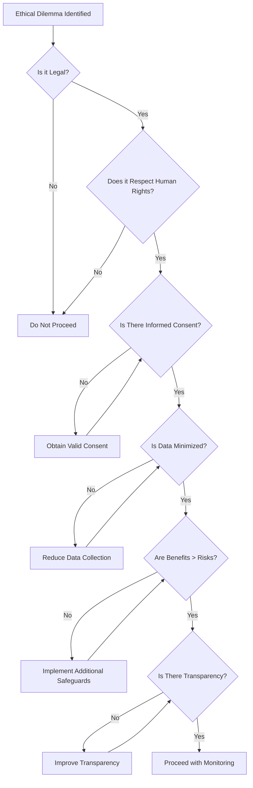

# ⚖️ Ethical Considerations - Harvard Remote System

## 📋 **Table of Contents**
1. [Ethical Framework](#ethical-framework)
2. [Responsible Use Guidelines](#responsible-use-guidelines)
3. [Privacy Protection](#privacy-protection)
4. [Consent and Transparency](#consent-and-transparency)
5. [Legal Compliance](#legal-compliance)
6. [Educational Use Ethics](#educational-use-ethics)
7. [Data Minimization](#data-minimization)
8. [User Rights and Autonomy](#user-rights-and-autonomy)
9. [Professional Responsibility](#professional-responsibility)
10. [Ethical Decision Framework](#ethical-decision-framework)
11. [Case Studies](#case-studies)
12. [Ethical Guidelines Checklist](#ethical-guidelines-checklist)

---

## 🎯 **Ethical Framework**

### **Core Ethical Principles**

The Harvard Remote System is built upon fundamental ethical principles that guide all aspects of its development, deployment, and use:

#### **1. Respect for Persons (Autonomy)**
- **Informed Consent**: Users must understand what data is collected and how it's used
- **Voluntary Participation**: No coercion or pressure to use the system
- **Right to Withdraw**: Users can discontinue use at any time
- **Capacity to Consent**: Ensuring users have the mental capacity to provide valid consent

#### **2. Beneficence (Do Good)**
- **Maximize Benefits**: Focus on legitimate educational and administrative purposes
- **Positive Impact**: Contribute to learning and system administration knowledge
- **Innovation for Good**: Advance understanding of remote system technologies
- **Social Benefit**: Serve broader educational and research communities

#### **3. Non-Maleficence (Do No Harm)**
- **Prevent Misuse**: Implement safeguards against malicious use
- **Minimize Risks**: Reduce potential for privacy violations or security breaches
- **Protect Vulnerable Populations**: Special considerations for minors and dependent users
- **Avoid Exploitation**: Prevent use for surveillance or oppression

#### **4. Justice (Fairness)**
- **Equal Access**: Fair distribution of benefits and risks
- **Non-Discrimination**: No bias based on personal characteristics
- **Proportionate Response**: Consequences match the severity of violations
- **Procedural Fairness**: Transparent and consistent decision-making processes

### **Ethical Use Matrix**
```
                    Educational  Research  Admin  Personal  Commercial
Legitimate Use         ✅         ✅       ✅      ⚠️        ❌
Informed Consent       ✅         ✅       ✅      ✅        ✅
Data Minimization     ✅         ✅       ✅      ✅        ✅
Transparency          ✅         ✅       ✅      ✅        ✅
Surveillance          ❌         ⚠️       ⚠️      ❌        ❌
Unauthorized Access   ❌         ❌       ❌      ❌        ❌

Legend: ✅ Acceptable  ⚠️ Conditional  ❌ Prohibited
```

---

## 📚 **Responsible Use Guidelines**

### **Acceptable Use Cases**

#### **✅ Educational Applications**
```markdown
**Computer Science Education**
- Learning Android development concepts
- Understanding client-server architecture
- Studying network protocols and security
- Demonstrating mobile application lifecycle

**System Administration Training**
- Remote device management techniques
- Network troubleshooting and diagnostics
- Security monitoring and response
- Automation and scripting practice

**Research Purposes**
- Mobile security research (with proper IRB approval)
- User interface and experience studies
- Performance optimization research
- Network behavior analysis
```

#### **✅ Administrative Use**
```markdown
**IT Management**
- Managing organization-owned devices
- Software deployment and updates
- Security compliance monitoring
- Technical support and troubleshooting

**Asset Management**
- Device inventory and tracking
- License compliance verification
- Hardware lifecycle management
- Usage analytics and reporting
```

### **Prohibited Use Cases**

#### **❌ Surveillance and Privacy Violations**
```markdown
**Unauthorized Monitoring**
- Tracking personal activities without consent
- Accessing private communications or data
- Recording audio/video without permission
- Location tracking without explicit consent

**Stalking or Harassment**
- Following individuals without consent
- Collecting personal information for harassment
- Intimidation or threatening behavior
- Violation of restraining orders or legal boundaries
```

#### **❌ Malicious Activities**
```markdown
**Criminal Activities**
- Data theft or unauthorized access
- Corporate espionage or trade secret theft
- Identity theft or financial fraud
- Distribution of malware or viruses

**Abuse of Power**
- Unauthorized access to personal devices
- Retaliation against individuals
- Discrimination or bias in monitoring
- Violation of employment or privacy laws
```

### **Implementation Guidelines**
```typescript
// Ethical use validation system
class EthicalUseValidator {
  validateUseCase(request: UseRequest): ValidationResult {
    const checks = [
      this.checkConsent(request),
      this.checkPurpose(request),
      this.checkProportionality(request),
      this.checkLegalCompliance(request),
      this.checkDataMinimization(request)
    ];
    
    const failedChecks = checks.filter(check => !check.passed);
    
    return {
      approved: failedChecks.length === 0,
      concerns: failedChecks.map(check => check.concern),
      recommendations: this.generateRecommendations(failedChecks)
    };
  }
  
  private checkConsent(request: UseRequest): EthicalCheck {
    return {
      name: 'Informed Consent',
      passed: request.hasValidConsent && request.consentIsInformed,
      concern: 'User consent may be invalid or uninformed'
    };
  }
  
  private checkPurpose(request: UseRequest): EthicalCheck {
    const legitimatePurposes = [
      'education', 'research', 'administration', 'security'
    ];
    
    return {
      name: 'Legitimate Purpose',
      passed: legitimatePurposes.includes(request.purpose),
      concern: 'Purpose may not be legitimate or ethical'
    };
  }
}
```

---

## 🔒 **Privacy Protection**

### **Privacy by Design Principles**

#### **1. Proactive Not Reactive**
```javascript
// Privacy-first architecture
class PrivacyFirstSystem {
  constructor() {
    // Default to most privacy-protective settings
    this.defaultSettings = {
      dataCollection: 'minimal',
      dataRetention: 'shortest',
      dataSharing: 'none',
      anonymization: 'enabled',
      encryption: 'always'
    };
  }
  
  initializeUser(userPreferences = {}) {
    // Start with privacy-protective defaults
    const settings = {
      ...this.defaultSettings,
      ...userPreferences
    };
    
    // Validate that user preferences don't reduce privacy
    return this.validatePrivacyLevel(settings);
  }
}
```

#### **2. Privacy as the Default**
```kotlin
// Android privacy-default configuration
class PrivacyDefaults {
    companion object {
        // Minimal data collection by default
        const val COLLECT_DEVICE_INFO = false
        const val COLLECT_LOCATION = false
        const val COLLECT_USAGE_STATS = false
        const val ENABLE_ANALYTICS = false
        
        // Maximum protection by default
        const val ENCRYPTION_ENABLED = true
        const val SECURE_STORAGE = true
        const val AUTO_DELETE_LOGS = true
        const val ANONYMOUS_MODE = true
    }
    
    fun getDefaultPrivacySettings(): PrivacySettings {
        return PrivacySettings(
            dataCollection = DataCollectionLevel.MINIMAL,
            retention = RetentionPolicy.SHORTEST,
            sharing = SharingPolicy.NONE,
            encryption = EncryptionLevel.MAXIMUM
        )
    }
}
```

#### **3. Full Functionality**
```typescript
// Maintain functionality while protecting privacy
class PrivacyPreservingFeatures {
  async executeCommand(command: string, privacyLevel: PrivacyLevel): Promise<CommandResult> {
    // Apply privacy filters based on user preferences
    const filteredCommand = this.applyPrivacyFilters(command, privacyLevel);
    
    // Execute with appropriate logging level
    const result = await this.executeSecurely(filteredCommand);
    
    // Filter sensitive information from results
    return this.filterSensitiveOutput(result, privacyLevel);
  }
  
  private applyPrivacyFilters(command: string, level: PrivacyLevel): string {
    switch (level) {
      case PrivacyLevel.MAXIMUM:
        return this.removePersonalIdentifiers(command);
      case PrivacyLevel.HIGH:
        return this.anonymizeCommand(command);
      case PrivacyLevel.STANDARD:
        return this.basicPrivacyFilter(command);
      default:
        return command;
    }
  }
}
```

### **Data Anonymization Techniques**
```python
# Advanced anonymization for educational data
class DataAnonymizer:
    def __init__(self):
        self.k_anonymity_threshold = 5
        self.l_diversity_threshold = 3
        
    def anonymize_device_data(self, device_data):
        """Apply k-anonymity and l-diversity"""
        
        # Remove direct identifiers
        anonymized = self.remove_direct_identifiers(device_data)
        
        # Generalize quasi-identifiers
        anonymized = self.generalize_attributes(anonymized)
        
        # Apply noise for differential privacy
        anonymized = self.add_differential_privacy_noise(anonymized)
        
        # Verify anonymization quality
        if not self.verify_anonymization(anonymized):
            raise Exception("Anonymization failed quality check")
            
        return anonymized
    
    def remove_direct_identifiers(self, data):
        """Remove obvious identifying information"""
        sensitive_fields = [
            'device_id', 'imei', 'phone_number', 'email',
            'mac_address', 'serial_number', 'user_name'
        ]
        
        cleaned_data = data.copy()
        for field in sensitive_fields:
            if field in cleaned_data:
                # Replace with anonymized identifier
                cleaned_data[field] = self.generate_anonymous_id(data[field])
                
        return cleaned_data
    
    def generalize_attributes(self, data):
        """Generalize quasi-identifying attributes"""
        
        # Location generalization
        if 'location' in data:
            data['location'] = self.generalize_location(data['location'])
            
        # Time generalization
        if 'timestamp' in data:
            data['timestamp'] = self.generalize_timestamp(data['timestamp'])
            
        # Device model generalization
        if 'device_model' in data:
            data['device_model'] = self.generalize_device_model(data['device_model'])
            
        return data
```

---

## ✅ **Consent and Transparency**

### **Informed Consent Framework**
```typescript
// Comprehensive consent management
class ConsentManager {
  async requestConsent(user: User, purposes: ConsentPurpose[]): Promise<ConsentResponse> {
    // Present clear, understandable information
    const consentRequest: ConsentRequest = {
      userId: user.id,
      purposes: purposes,
      dataTypes: this.getDataTypesForPurposes(purposes),
      retentionPeriod: this.getRetentionPeriod(purposes),
      thirdPartySharing: this.getThirdPartyInfo(purposes),
      userRights: this.getUserRights(),
      consequences: this.getConsequencesOfRefusal(purposes),
      timestamp: new Date(),
      version: this.getCurrentConsentVersion()
    };
    
    // Present in user's preferred language
    const localizedRequest = await this.localize(consentRequest, user.language);
    
    // Ensure user has time to read and understand
    await this.enforceReadingTime(localizedRequest);
    
    // Collect consent with clear options
    return await this.collectConsent(localizedRequest);
  }
  
  private async enforceReadingTime(request: ConsentRequest): Promise<void> {
    const estimatedReadTime = this.calculateReadTime(request);
    const minimumTime = Math.max(estimatedReadTime * 0.5, 30000); // At least 30 seconds
    
    // Don't allow consent before minimum reading time
    await this.delay(minimumTime);
  }
  
  async withdrawConsent(userId: string, purposes: ConsentPurpose[]): Promise<void> {
    // Make withdrawal as easy as granting consent
    await this.processWithdrawal(userId, purposes);
    
    // Stop all processing for withdrawn purposes
    await this.stopProcessing(userId, purposes);
    
    // Notify user of successful withdrawal
    await this.sendWithdrawalConfirmation(userId);
  }
}
```

### **Transparency Dashboard**
```kotlin
// Android transparency features
class TransparencyDashboard(private val context: Context) {
    
    fun showDataUsageReport() {
        val intent = Intent(context, DataUsageActivity::class.java).apply {
            putExtra("report_type", "data_usage")
        }
        context.startActivity(intent)
    }
    
    fun generatePrivacyReport(): PrivacyReport {
        return PrivacyReport(
            dataCollected = getDataCollectionSummary(),
            purposesUsed = getProcessingPurposes(),
            thirdPartySharing = getThirdPartySharing(),
            retentionPeriod = getDataRetentionInfo(),
            userRights = getUserRights(),
            contactInfo = getPrivacyContactInfo()
        )
    }
    
    private fun getDataCollectionSummary(): List<DataCategory> {
        return listOf(
            DataCategory(
                name = "Device Information",
                collected = true,
                purpose = "System functionality",
                retention = "Until app uninstall"
            ),
            DataCategory(
                name = "Usage Analytics",
                collected = getUserPreference("analytics_enabled"),
                purpose = "Improve user experience",
                retention = "90 days"
            ),
            DataCategory(
                name = "Location Data",
                collected = hasLocationPermission(),
                purpose = "Geographic analysis",
                retention = "30 days"
            )
        )
    }
}

data class PrivacyReport(
    val dataCollected: List<DataCategory>,
    val purposesUsed: List<ProcessingPurpose>,
    val thirdPartySharing: List<ThirdPartyShare>,
    val retentionPeriod: RetentionPolicy,
    val userRights: List<UserRight>,
    val contactInfo: ContactInformation
)
```

---

## ⚖️ **Legal Compliance**

### **Multi-Jurisdiction Compliance**
```typescript
// Legal compliance framework
class LegalComplianceManager {
  private regulations: Map<string, RegulationHandler> = new Map();
  
  constructor() {
    // Initialize handlers for different regulations
    this.regulations.set('GDPR', new GDPRHandler());
    this.regulations.set('CCPA', new CCPAHandler());
    this.regulations.set('PIPEDA', new PIPEDAHandler());
    this.regulations.set('LGPD', new LGPDHandler());
  }
  
  async ensureCompliance(operation: DataOperation): Promise<ComplianceResult> {
    const applicableRegulations = this.getApplicableRegulations(operation);
    const results: ComplianceCheck[] = [];
    
    for (const regulation of applicableRegulations) {
      const handler = this.regulations.get(regulation);
      if (handler) {
        const result = await handler.checkCompliance(operation);
        results.push(result);
      }
    }
    
    return this.aggregateResults(results);
  }
  
  private getApplicableRegulations(operation: DataOperation): string[] {
    const regulations: string[] = [];
    
    // Check user location for applicable laws
    if (operation.userLocation?.includes('EU')) {
      regulations.push('GDPR');
    }
    
    if (operation.userLocation?.includes('California')) {
      regulations.push('CCPA');
    }
    
    if (operation.userLocation?.includes('Canada')) {
      regulations.push('PIPEDA');
    }
    
    if (operation.userLocation?.includes('Brazil')) {
      regulations.push('LGPD');
    }
    
    return regulations;
  }
}

// GDPR-specific compliance
class GDPRHandler implements RegulationHandler {
  async checkCompliance(operation: DataOperation): Promise<ComplianceCheck> {
    const checks = [
      this.checkLawfulBasis(operation),
      this.checkDataMinimization(operation),
      this.checkPurposeLimitation(operation),
      this.checkStorageLimitation(operation),
      this.checkAccountability(operation)
    ];
    
    const failedChecks = checks.filter(check => !check.compliant);
    
    return {
      regulation: 'GDPR',
      compliant: failedChecks.length === 0,
      issues: failedChecks,
      recommendations: this.generateRecommendations(failedChecks)
    };
  }
  
  private checkLawfulBasis(operation: DataOperation): ComplianceCheck {
    const validBases = ['consent', 'contract', 'legal_obligation', 'vital_interests', 'public_task', 'legitimate_interests'];
    
    return {
      name: 'Lawful Basis',
      compliant: validBases.includes(operation.lawfulBasis),
      details: `Operation must have valid lawful basis under GDPR Article 6`
    };
  }
}
```

### **Academic Institution Compliance**
```markdown
## 🎓 Academic Compliance Requirements

### FERPA (Family Educational Rights and Privacy Act)
**Applicable when used in educational settings with student data**

**Requirements:**
- Obtain written consent before disclosing student records
- Allow students/parents to inspect and review records
- Provide process for challenging record accuracy
- Limit directory information disclosure
- Maintain audit trail of disclosures

**Implementation:**
```typescript
class FERPACompliance {
  async handleStudentData(data: StudentData): Promise<void> {
    // Classify data sensitivity
    if (this.isEducationalRecord(data)) {
      await this.requireWrittenConsent();
    }
    
    // Apply directory information rules
    if (this.isDirectoryInformation(data)) {
      await this.checkOptOutStatus(data.studentId);
    }
    
    // Log all access for audit
    await this.logAccess(data, this.getCurrentUser());
  }
}
```

### IRB (Institutional Review Board) Compliance
**Required for research involving human subjects**

**Process:**
1. Submit research protocol to IRB
2. Demonstrate minimal risk to participants
3. Obtain informed consent from subjects
4. Implement data protection measures
5. Report adverse events or protocol changes

### CITI Training Requirements
**Mandatory for researchers handling human subject data**

- Complete Collaborative Institutional Training Initiative
- Maintain current certification
- Understand research ethics principles
- Document training completion
```

---

## 🎓 **Educational Use Ethics**

### **Academic Integrity Guidelines**
```markdown
## 📚 Ethical Academic Use

### For Students
**✅ Acceptable Academic Uses:**
- Learning mobile development concepts
- Understanding system architecture
- Practicing security implementations
- Completing course assignments
- Collaborative learning projects

**❌ Academic Misconduct:**
- Plagiarizing code without attribution
- Circumventing academic monitoring systems
- Accessing unauthorized academic resources
- Sharing solutions for individual assignments
- Using for exam cheating or fraud

### For Educators
**✅ Responsible Teaching Uses:**
- Demonstrating technical concepts
- Providing hands-on learning experiences
- Teaching security and privacy principles
- Illustrating real-world applications
- Assessment and evaluation tools

**❌ Inappropriate Educational Uses:**
- Unauthorized student monitoring
- Violating student privacy rights
- Discriminatory grading or treatment
- Excessive surveillance of personal devices
- Sharing student data without consent
```

### **Student Privacy Protection**
```kotlin
// Student-specific privacy protections
class StudentPrivacyManager {
    
    fun handleStudentData(data: StudentData): StudentDataResult {
        // Extra protections for minors
        if (data.age < 18) {
            return handleMinorData(data)
        }
        
        // Apply FERPA protections
        if (isEducationalRecord(data)) {
            return handleEducationalRecord(data)
        }
        
        return handleGeneralStudentData(data)
    }
    
    private fun handleMinorData(data: StudentData): StudentDataResult {
        return StudentDataResult(
            requireParentalConsent = true,
            limitedDataCollection = true,
            enhancedProtection = true,
            shorterRetention = true,
            additionalOversight = true
        )
    }
    
    private fun handleEducationalRecord(data: StudentData): StudentDataResult {
        return StudentDataResult(
            ferpaProtection = true,
            auditTrail = true,
            accessControl = true,
            disclosureTracking = true,
            parentalRights = data.age < 18
        )
    }
}
```

---

## 🔒 **Data Minimization**

### **Data Collection Principles**
```typescript
// Data minimization implementation
class DataMinimizationEngine {
  private necessaryData: Map<string, DataRequirement> = new Map();
  
  constructor() {
    this.defineNecessaryData();
  }
  
  private defineNecessaryData() {
    // Define what data is actually necessary for each purpose
    this.necessaryData.set('device_management', {
      required: ['device_id', 'os_version', 'app_version'],
      optional: ['device_model', 'manufacturer'],
      prohibited: ['personal_files', 'contacts', 'messages']
    });
    
    this.necessaryData.set('security_monitoring', {
      required: ['connection_logs', 'authentication_events'],
      optional: ['system_events'],
      prohibited: ['user_content', 'private_communications']
    });
  }
  
  validateDataCollection(purpose: string, requestedData: string[]): ValidationResult {
    const requirement = this.necessaryData.get(purpose);
    if (!requirement) {
      return { valid: false, reason: 'Unknown purpose' };
    }
    
    // Check for prohibited data
    const prohibitedRequested = requestedData.filter(
      data => requirement.prohibited.includes(data)
    );
    
    if (prohibitedRequested.length > 0) {
      return {
        valid: false,
        reason: `Prohibited data requested: ${prohibitedRequested.join(', ')}`
      };
    }
    
    // Check if all required data is included
    const missingRequired = requirement.required.filter(
      data => !requestedData.includes(data)
    );
    
    if (missingRequired.length > 0) {
      return {
        valid: false,
        reason: `Missing required data: ${missingRequired.join(', ')}`
      };
    }
    
    return { valid: true };
  }
}
```

### **Purpose Limitation Framework**
```python
class PurposeLimitationFramework:
    def __init__(self):
        self.purpose_definitions = {
            'system_administration': {
                'description': 'Managing and maintaining system functionality',
                'data_types': ['system_logs', 'performance_metrics', 'error_reports'],
                'retention': '90_days',
                'sharing': 'internal_only'
            },
            'security_monitoring': {
                'description': 'Detecting and preventing security threats',
                'data_types': ['access_logs', 'authentication_events', 'security_alerts'],
                'retention': '1_year',
                'sharing': 'security_team_only'
            },
            'educational_research': {
                'description': 'Academic research with IRB approval',
                'data_types': ['anonymized_usage_patterns', 'performance_data'],
                'retention': 'study_duration_plus_7_years',
                'sharing': 'research_team_only'
            }
        }
    
    def validate_purpose_compliance(self, data_usage):
        """Ensure data is only used for stated purposes"""
        
        stated_purpose = data_usage.get('purpose')
        actual_usage = data_usage.get('usage_pattern')
        
        if stated_purpose not in self.purpose_definitions:
            return False, "Purpose not recognized"
        
        allowed_usage = self.purpose_definitions[stated_purpose]
        
        # Check data types
        if not self.check_data_types(actual_usage, allowed_usage['data_types']):
            return False, "Data types exceed stated purpose"
        
        # Check retention period
        if not self.check_retention(data_usage, allowed_usage['retention']):
            return False, "Retention period exceeds purpose requirements"
        
        # Check sharing restrictions
        if not self.check_sharing(data_usage, allowed_usage['sharing']):
            return False, "Data sharing violates purpose limitations"
        
        return True, "Purpose compliance verified"
```

---

## 👤 **User Rights and Autonomy**

### **Digital Rights Framework**
```typescript
// User rights implementation
class UserRightsManager {
  private rights: Map<string, UserRight> = new Map();
  
  constructor() {
    this.initializeUserRights();
  }
  
  private initializeUserRights() {
    this.rights.set('access', {
      name: 'Right to Access',
      description: 'Users can request access to their personal data',
      implementation: this.handleAccessRequest.bind(this),
      timeLimit: 30 // days
    });
    
    this.rights.set('rectification', {
      name: 'Right to Rectification',
      description: 'Users can request correction of inaccurate data',
      implementation: this.handleRectificationRequest.bind(this),
      timeLimit: 30
    });
    
    this.rights.set('erasure', {
      name: 'Right to Erasure',
      description: 'Users can request deletion of their data',
      implementation: this.handleErasureRequest.bind(this),
      timeLimit: 30
    });
    
    this.rights.set('portability', {
      name: 'Right to Data Portability',
      description: 'Users can request their data in portable format',
      implementation: this.handlePortabilityRequest.bind(this),
      timeLimit: 30
    });
    
    this.rights.set('objection', {
      name: 'Right to Object',
      description: 'Users can object to processing of their data',
      implementation: this.handleObjectionRequest.bind(this),
      timeLimit: 7
    });
  }
  
  async exerciseRight(userId: string, rightType: string, details?: any): Promise<RightExerciseResult> {
    const right = this.rights.get(rightType);
    if (!right) {
      throw new Error(`Unknown right type: ${rightType}`);
    }
    
    // Log the request
    await this.logRightExercise(userId, rightType, details);
    
    // Verify user identity
    const identity = await this.verifyUserIdentity(userId);
    if (!identity.verified) {
      return { success: false, reason: 'Identity verification failed' };
    }
    
    // Execute the right
    const result = await right.implementation(userId, details);
    
    // Track compliance with time limits
    await this.trackResponseTime(userId, rightType, right.timeLimit);
    
    return result;
  }
  
  private async handleAccessRequest(userId: string): Promise<RightExerciseResult> {
    try {
      const userData = await this.dataService.getUserData(userId);
      const processingActivities = await this.getProcessingActivities(userId);
      
      const report = {
        personalData: userData,
        processingPurposes: processingActivities.map(a => a.purpose),
        dataCategories: userData.map(d => d.category),
        recipients: processingActivities.map(a => a.recipients).flat(),
        retentionPeriods: processingActivities.map(a => a.retention),
        dataSubjectRights: Object.keys(this.rights)
      };
      
      await this.deliverAccessReport(userId, report);
      
      return { success: true, data: report };
    } catch (error) {
      return { success: false, reason: error.message };
    }
  }
}
```

### **Autonomy Preservation**
```kotlin
// Android user autonomy features
class UserAutonomyManager(private val context: Context) {
    
    fun enableUserControl() {
        setupPrivacyDashboard()
        implementConsentControls()
        provideOptOutMechanisms()
        enableDataPortability()
    }
    
    private fun setupPrivacyDashboard() {
        val dashboardIntent = Intent(context, PrivacyDashboardActivity::class.java)
        
        // Add shortcut to privacy controls
        val shortcutManager = context.getSystemService(ShortcutManager::class.java)
        val shortcut = ShortcutInfo.Builder(context, "privacy_dashboard")
            .setShortLabel("Privacy Settings")
            .setLongLabel("Privacy and Data Controls")
            .setIcon(Icon.createWithResource(context, R.drawable.ic_privacy))
            .setIntent(dashboardIntent)
            .build()
        
        shortcutManager.dynamicShortcuts = listOf(shortcut)
    }
    
    private fun implementConsentControls() {
        // Granular consent controls
        val consentPreferences = ConsentPreferences(context)
        
        consentPreferences.apply {
            setAnalyticsConsent(false) // Default to opt-out
            setCrashReportingConsent(false)
            setUsageStatisticsConsent(false)
            setLocationDataConsent(false)
        }
    }
    
    fun handleOptOutRequest(dataType: DataType) {
        when (dataType) {
            DataType.ANALYTICS -> {
                disableAnalytics()
                deleteExistingAnalyticsData()
            }
            DataType.LOCATION -> {
                disableLocationTracking()
                deleteLocationHistory()
            }
            DataType.USAGE_STATS -> {
                disableUsageTracking()
                deleteUsageHistory()
            }
        }
        
        // Confirm opt-out to user
        showOptOutConfirmation(dataType)
    }
}
```

---

## 👨‍💼 **Professional Responsibility**

### **Developer Ethics Code**
```markdown
## 💻 Developer Code of Ethics

### Professional Standards
1. **Competence**: Maintain and improve professional knowledge and skills
2. **Integrity**: Act honestly and transparently in all professional relationships
3. **Accountability**: Take responsibility for professional decisions and actions
4. **Respect**: Treat all individuals with dignity and respect
5. **Service**: Contribute positively to society through technology

### Technical Responsibilities
- **Security**: Implement robust security measures to protect user data
- **Privacy**: Design systems that respect and protect user privacy
- **Accessibility**: Ensure systems are accessible to users with disabilities
- **Reliability**: Build systems that perform consistently and reliably
- **Transparency**: Clearly communicate system capabilities and limitations

### Ethical Decision-Making Process
1. **Identify** the ethical issue or dilemma
2. **Gather** relevant facts and stakeholder perspectives
3. **Consider** applicable laws, regulations, and ethical principles
4. **Evaluate** potential consequences and alternatives
5. **Decide** on the most ethical course of action
6. **Implement** the decision with appropriate safeguards
7. **Monitor** outcomes and adjust as necessary
```

### **Stakeholder Responsibility Matrix**
```typescript
// Stakeholder responsibility framework
class StakeholderResponsibilityManager {
  private responsibilities: Map<string, Responsibility[]> = new Map();
  
  constructor() {
    this.defineResponsibilities();
  }
  
  private defineResponsibilities() {
    // Developers
    this.responsibilities.set('developers', [
      { area: 'Security', description: 'Implement secure coding practices' },
      { area: 'Privacy', description: 'Design privacy-preserving features' },
      { area: 'Accessibility', description: 'Ensure inclusive design' },
      { area: 'Documentation', description: 'Provide clear, accurate documentation' }
    ]);
    
    // System Administrators
    this.responsibilities.set('administrators', [
      { area: 'Data Protection', description: 'Secure data storage and transmission' },
      { area: 'Access Control', description: 'Implement appropriate access controls' },
      { area: 'Monitoring', description: 'Monitor for security threats and breaches' },
      { area: 'Compliance', description: 'Ensure regulatory compliance' }
    ]);
    
    // Users
    this.responsibilities.set('users', [
      { area: 'Responsible Use', description: 'Use system ethically and legally' },
      { area: 'Consent', description: 'Provide informed consent for data processing' },
      { area: 'Reporting', description: 'Report misuse or security issues' },
      { area: 'Updates', description: 'Keep systems updated and secure' }
    ]);
    
    // Organizations
    this.responsibilities.set('organizations', [
      { area: 'Governance', description: 'Establish ethical use policies' },
      { area: 'Training', description: 'Provide ethics and security training' },
      { area: 'Oversight', description: 'Monitor and audit system use' },
      { area: 'Incident Response', description: 'Respond appropriately to incidents' }
    ]);
  }
  
  getResponsibilities(stakeholder: string): Responsibility[] {
    return this.responsibilities.get(stakeholder) || [];
  }
  
  validateResponsibilityFulfillment(stakeholder: string, actions: Action[]): ValidationResult {
    const requiredResponsibilities = this.getResponsibilities(stakeholder);
    const fulfilledResponsibilities = this.assessFulfillment(actions, requiredResponsibilities);
    
    return {
      stakeholder,
      totalResponsibilities: requiredResponsibilities.length,
      fulfilledCount: fulfilledResponsibilities.length,
      percentageFulfilled: (fulfilledResponsibilities.length / requiredResponsibilities.length) * 100,
      gaps: requiredResponsibilities.filter(r => !fulfilledResponsibilities.includes(r))
    };
  }
}
```

---

## 🧭 **Ethical Decision Framework**

### **Decision Tree for Ethical Dilemmas**


### **Ethical Assessment Tool**
```python
class EthicalAssessmentTool:
    def __init__(self):
        self.criteria = {
            'legality': {'weight': 0.25, 'threshold': 1.0},
            'consent': {'weight': 0.20, 'threshold': 0.8},
            'privacy': {'weight': 0.20, 'threshold': 0.8},
            'transparency': {'weight': 0.15, 'threshold': 0.7},
            'proportionality': {'weight': 0.10, 'threshold': 0.7},
            'accountability': {'weight': 0.10, 'threshold': 0.7}
        }
    
    def assess_ethical_compliance(self, proposal):
        """Comprehensive ethical assessment"""
        
        scores = {}
        
        # Legal compliance
        scores['legality'] = self.assess_legality(proposal)
        
        # Consent validity
        scores['consent'] = self.assess_consent(proposal)
        
        # Privacy protection
        scores['privacy'] = self.assess_privacy(proposal)
        
        # Transparency level
        scores['transparency'] = self.assess_transparency(proposal)
        
        # Proportionality
        scores['proportionality'] = self.assess_proportionality(proposal)
        
        # Accountability measures
        scores['accountability'] = self.assess_accountability(proposal)
        
        # Calculate weighted score
        total_score = sum(
            scores[criterion] * self.criteria[criterion]['weight']
            for criterion in scores
        )
        
        # Check if all thresholds are met
        threshold_violations = [
            criterion for criterion, score in scores.items()
            if score < self.criteria[criterion]['threshold']
        ]
        
        return {
            'overall_score': total_score,
            'individual_scores': scores,
            'threshold_violations': threshold_violations,
            'recommendation': self.generate_recommendation(total_score, threshold_violations),
            'required_improvements': self.suggest_improvements(threshold_violations)
        }
    
    def assess_legality(self, proposal):
        """Assess legal compliance"""
        legal_factors = [
            self.check_privacy_laws(proposal),
            self.check_data_protection_regulations(proposal),
            self.check_computer_fraud_laws(proposal),
            self.check_industry_regulations(proposal)
        ]
        
        return min(legal_factors)  # Must comply with all laws
    
    def assess_consent(self, proposal):
        """Assess consent validity and quality"""
        consent_factors = [
            proposal.get('informed_consent', 0),
            proposal.get('voluntary_consent', 0),
            proposal.get('specific_consent', 0),
            proposal.get('revocable_consent', 0)
        ]
        
        return sum(consent_factors) / len(consent_factors)
    
    def generate_recommendation(self, score, violations):
        """Generate ethical recommendation"""
        if score >= 0.8 and not violations:
            return "APPROVED: High ethical compliance"
        elif score >= 0.6 and len(violations) <= 1:
            return "CONDITIONAL: Address identified issues"
        else:
            return "REJECTED: Significant ethical concerns"
```

---

## 📖 **Case Studies**

### **Case Study 1: Educational Monitoring**
```markdown
**Scenario**: A university wants to use the Remote System to monitor student devices in computer labs to prevent cheating during exams.

**Ethical Analysis**:
- **Legitimate Purpose**: ✅ Academic integrity is a valid concern
- **Proportionality**: ⚠️ Continuous monitoring may be excessive
- **Transparency**: ✅ Students can be informed of monitoring
- **Consent**: ⚠️ May be coercive due to academic requirements
- **Privacy Impact**: ❌ High - monitoring all device activity

**Recommendation**: 
- Limit monitoring to exam periods only
- Monitor only exam-related applications
- Provide clear notice and alternative testing options
- Implement technical safeguards to prevent over-collection

**Better Alternative**: 
Use application-level controls that block unauthorized programs during exams rather than comprehensive device monitoring.
```

### **Case Study 2: Corporate Device Management**
```markdown
**Scenario**: A company wants to monitor employee personal devices that access corporate email.

**Ethical Analysis**:
- **Legitimate Purpose**: ✅ Protecting corporate data
- **Proportionality**: ❌ Personal devices require different treatment
- **Employee Rights**: ❌ Extensive personal privacy invasion
- **Legal Compliance**: ⚠️ May violate employment laws
- **Technical Feasibility**: ⚠️ Difficult to separate personal/business use

**Recommendation**:
- Implement containerization solutions
- Separate business and personal data
- Limit monitoring to business containers only
- Provide company devices for business use
- Obtain explicit employee consent with opt-out alternatives
```

### **Case Study 3: Research on Mobile Security**
```markdown
**Scenario**: Researchers want to collect device data to study mobile security vulnerabilities.

**Ethical Analysis**:
- **Scientific Merit**: ✅ Important security research
- **IRB Approval**: ✅ Required for human subjects research
- **Risk-Benefit**: ✅ Benefits outweigh minimal risks
- **Data Minimization**: ✅ Collect only necessary data
- **Anonymization**: ✅ Remove personal identifiers

**Recommendation**:
- Obtain IRB approval before data collection
- Implement differential privacy techniques
- Provide clear consent with withdrawal options
- Share findings with security community
- Follow responsible disclosure for vulnerabilities found
```

---

## ✅ **Ethical Guidelines Checklist**

### **Pre-Deployment Checklist**
```markdown
## 🔍 Ethical Compliance Checklist

### Legal Compliance
- [ ] Reviewed applicable privacy laws (GDPR, CCPA, etc.)
- [ ] Assessed computer fraud and abuse laws
- [ ] Checked industry-specific regulations
- [ ] Obtained legal review if required
- [ ] Documented legal compliance measures

### Consent and Transparency
- [ ] Designed clear, understandable consent process
- [ ] Implemented granular consent options
- [ ] Created transparent privacy policy
- [ ] Provided easy consent withdrawal mechanism
- [ ] Tested consent interface with users

### Data Protection
- [ ] Implemented data minimization principles
- [ ] Applied appropriate anonymization techniques
- [ ] Secured data storage and transmission
- [ ] Defined clear data retention policies
- [ ] Established data breach response procedures

### User Rights
- [ ] Implemented data access mechanisms
- [ ] Provided data correction capabilities
- [ ] Enabled data deletion functionality
- [ ] Created data portability features
- [ ] Established user complaint process

### Technical Safeguards
- [ ] Conducted security vulnerability assessment
- [ ] Implemented access controls and authentication
- [ ] Applied encryption for sensitive data
- [ ] Established audit logging and monitoring
- [ ] Tested incident response procedures

### Organizational Measures
- [ ] Trained staff on ethical use policies
- [ ] Established ethics review process
- [ ] Created incident reporting mechanisms
- [ ] Defined roles and responsibilities
- [ ] Implemented ongoing monitoring and review
```

### **Ongoing Compliance Monitoring**
```typescript
// Continuous ethical compliance monitoring
class EthicsMonitor {
  private complianceChecks: ComplianceCheck[] = [];
  
  scheduleRegularReviews() {
    // Monthly privacy impact assessments
    cron.schedule('0 0 1 * *', () => {
      this.conductPrivacyImpactAssessment();
    });
    
    // Quarterly ethics reviews
    cron.schedule('0 0 1 */3 *', () => {
      this.conductEthicsReview();
    });
    
    // Annual compliance audits
    cron.schedule('0 0 1 1 *', () => {
      this.conductComplianceAudit();
    });
  }
  
  async conductPrivacyImpactAssessment(): Promise<PIAResult> {
    const assessment = {
      dataFlows: await this.analyzeDataFlows(),
      riskAssessment: await this.assessPrivacyRisks(),
      safeguards: await this.reviewSafeguards(),
      userFeedback: await this.collectUserFeedback()
    };
    
    return this.generatePIAReport(assessment);
  }
  
  async monitorConsentCompliance(): Promise<ConsentComplianceReport> {
    const metrics = {
      consentRates: await this.getConsentRates(),
      withdrawalRates: await this.getWithdrawalRates(),
      consentAge: await this.analyzeConsentAge(),
      userComplaints: await this.getConsentComplaints()
    };
    
    return this.generateConsentReport(metrics);
  }
}
```

---

## 📞 **Ethics Resources and Contacts**

### **Professional Ethics Organizations**
- **ACM (Association for Computing Machinery)**: Code of Ethics and Professional Conduct
- **IEEE Computer Society**: Software Engineering Code of Ethics
- **ISACA**: Professional Ethics and Standards
- **IAPP (International Association of Privacy Professionals)**: Privacy ethics resources

### **Academic Ethics Support**
- **University IRB (Institutional Review Board)**: Human subjects research approval
- **Ethics Committees**: Guidance on research ethics
- **Privacy Officers**: Data protection compliance support
- **Legal Counsel**: Legal compliance and risk assessment

### **Emergency Ethical Guidance**
```markdown
**When in Doubt:**
1. **Stop** the questionable activity immediately
2. **Consult** with ethics officer or legal counsel
3. **Document** the ethical concern and response
4. **Report** to appropriate oversight body
5. **Follow up** to ensure proper resolution

**Emergency Contacts:**
- University Ethics Hotline: [Phone Number]
- Privacy Officer: [Email]
- Legal Counsel: [Contact Info]
- IRB Office: [Contact Info]
```

---

**🎓 Academic Excellence:** This ethical considerations guide demonstrates the critical importance of ethical thinking in Computer Science, preparing students to be responsible technologists who consider the broader implications of their work on society, privacy, and human rights.

*Remember: "With great power comes great responsibility." - Uncle Ben (Spider-Man)*

*"Technology is neither good nor bad; nor is it neutral." - Melvin Kranzberg*
